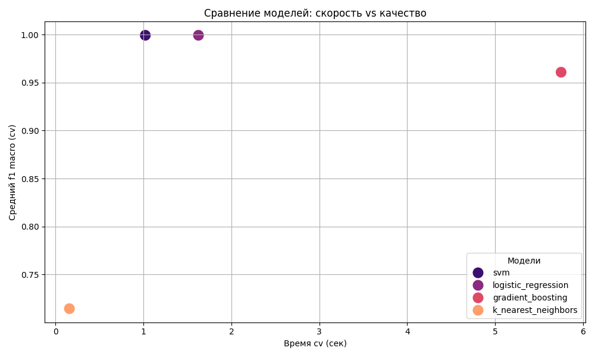
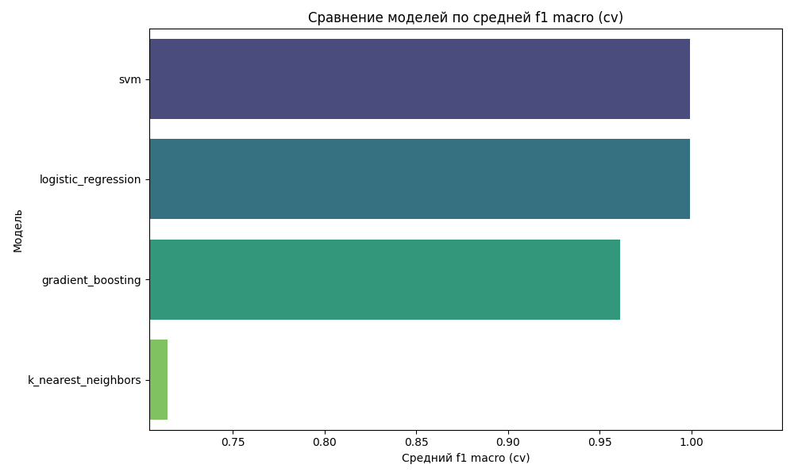

# MLOps пайплайн для прогнозирования риска астмы

## 1. Описание выбранного датасета и задачи

### Датасет
Для данного проекта был выбран публичный датасет **"Asthma Risk & Severity Dataset"**. Этот датасет содержит синтетические, но реалистичные данные о пациентах, включающие демографическую информацию, клинические показатели, историю болезней и факторы образа жизни.

**Ключевые признаки в датасете:**
*   **Демографические:** `Age`, `Gender`, `BMI`
*   **Факторы риска:** `Family_History` (семейный анамнез), `Allergies`, `Smoking_Status`
*   **Клинические биомаркеры:** `Peak_Expiratory_Flow` (пиковая скорость выдоха), `FeNO_Level` (уровень оксида азота в выдыхаемом воздухе)
*   **Факторы окружения:** `Air_Pollution_Level`, `Occupation_Type`

### Задача
Разработать и оценить MLOps-пайплайн для решения задачи **бинарной классификации**: на основе предоставленных признаков предсказать наличие у пациента астмы. Целевой переменной является столбец `Has_Asthma` (1 - астма есть, 0 - астмы нет)

## 2. Описание использованных алгоритмов

В проекте реализовано 4 различных алгоритма ML. Оценка производительности моделей проводилась с помощью кросс-валидации на 5 фолдах по метрике F1-macro

1.  **Логистическая регрессия (с L1 регуляризацией)** - baseline-модель
2.  **Градиентный бустинг** 
3.  **SVM с линейным ядром** 
4.  **K-Nearest Neighbors**

## 3. Инструкции по запуску проекта

### 3.1 Предварительные требования
*   Python 3.9+
*   Git

### 3.2 Установка и настройка

1.  **Клонируйте репозиторий:**
    ```bash
    git clone https://github.com/Arishandrina/MLOps-project.git
    cd MLOps-project
    ```

2.  **Создайте и активируйте виртуальное окружение:**
    ```bash
    python3 -m venv .venv
    source .venv/bin/activate
    ```

3.  **Установите все необходимые зависимости:**
    ```bash
    pip install -r requirements.txt
    ```

4.  **Загрузите данные из DVC-хранилища:**
    ```bash
    dvc pull
    ```

## 4. Команды для воспроизведения экспериментов

1.  **Воспроизведение полного пайплайна (предобработка + обучение):**
    ```bash
    dvc repro
    ```

2.  **Запуск MLflow UI для просмотра результатов:**

    *Откройте новый терминал, активируйте окружение (`source .venv/bin/activate`) и запустите сервер*
    ```bash
    mlflow ui
    ```
    *После перейдите по адресу `http://127.0.0.1:5000` в браузере*

4.  **Запуск подбора гиперпараметров для Gradient Boosting:**
    ```bash
    python tune_model.py
    ```
    *Результаты появятся в MLflow UI в эксперименте `Asthma hyperparameter tuning for gb`*

5.  **Генерация итоговых графиков для отчета:**
    ```bash
    python visualize_results.py
    ```
    *Графики со сравнением производительности моделей сохраняются в папку `visualizations/`*

## 5. Результаты экспериментов и выводы

### Результаты
Все эксперименты были залогированы в MLflow. Основная метрика для сравнения моделей - mean F1-score macro на кросс-валидации




### Выводы
Линейные модели (логистическая регрессия, SVM) и гардиентный бустинг показали очень высокое и похожее качество. Возможно, в датасете есть очень сильные предикторы.Более сложные и медленные модели, такие как градиентный бустинг, не дают существенного прироста в качестве по сравнению с быстрыми и простыми линейными методами. У kNN худший результат, возможно из-за проклятия размерности после one-hot кодирования категориальных признаков

**Итого:** для решения данной задачи наиболее подходящими являются **SVM с линейным ядром** или **логистическая регрессия**, так как они обеспечивают максимальное качество при минимальных вычислительных затратах
